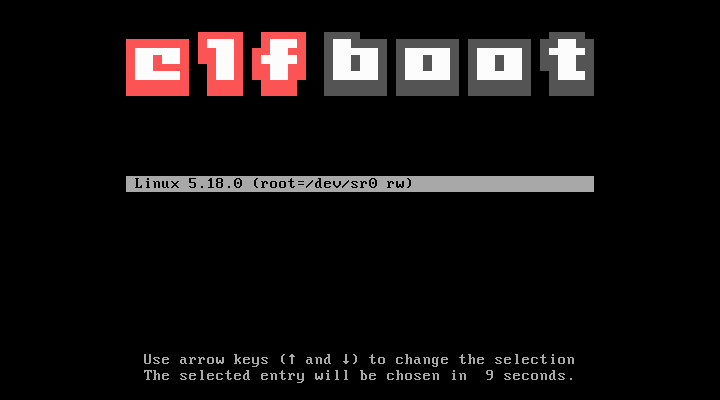

A multiboot-compliant *Executable and Linking Format* (ELF) bootloader for the x86 architecture.

### Features ###

The **elfboot** bootloader is highly modular. It supports drivers for both IDE and AHCI/RAID controllers. Also, further modules include file system drivers like *ISO 9660*. For the graphical boot menu, a simple PS/2 keyboard module is available, too.

Currently, we support the following modules:

 - Programmable Interval Timer (PIT)
 - PS/2 Keyboard module

For PCI devices, we also provide modules for:

 - IDE controller
 - AHCI/RAID controller

Even the screen is managed by a module, which depends on the screen resolution used:

 - TTY driver <sub>(currently VGA only)</sub>

### Building elfboot ###

**elfboot** requires the use of a dedicated toolchain, included in this project. The toolchain is generated simply by typing

```
make toolchain
```

All that's left is to configure the elfboot settings in the `elfboot.config` file. If you are happy with the configured options, build the bootloader by typing

```
make iso
```

> **Note**: For now, we only support the generation of *ISO 9660* formatted disks. In the near future, we also want to support other file systems.

### Booting kernels ###

Each boot entry is defined in the `elfboot.cfg` boot file, which contains information about each kernel found. If only one entry is available, you can configure elfboot to directly boot the kernel without any graphical boot menu.

> **Note**: Currently, we only support booting Linux. Further boot protocols are going to be introduced in the near future.

We currently support the following boot protocols:

 - Linux (module **lxboot**)

In the near future, we want to at least implement two more protocols:

 - Multiboot Legacy
 - Multiboot 2
 - Stivale

### Screenshot ###

